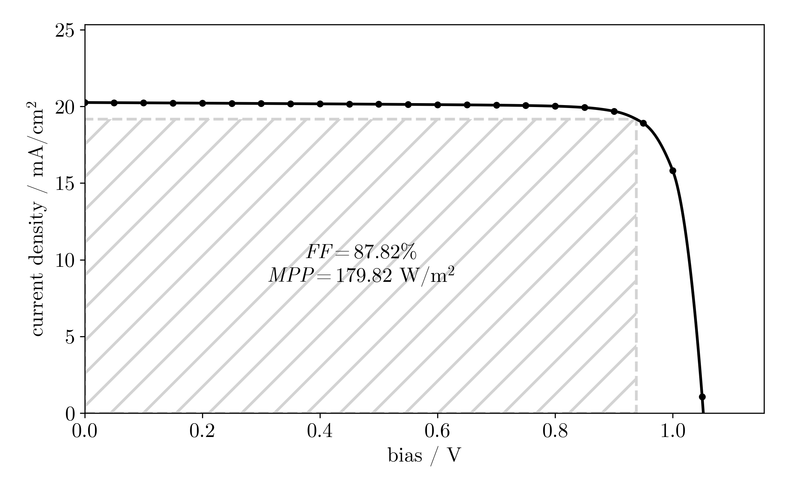
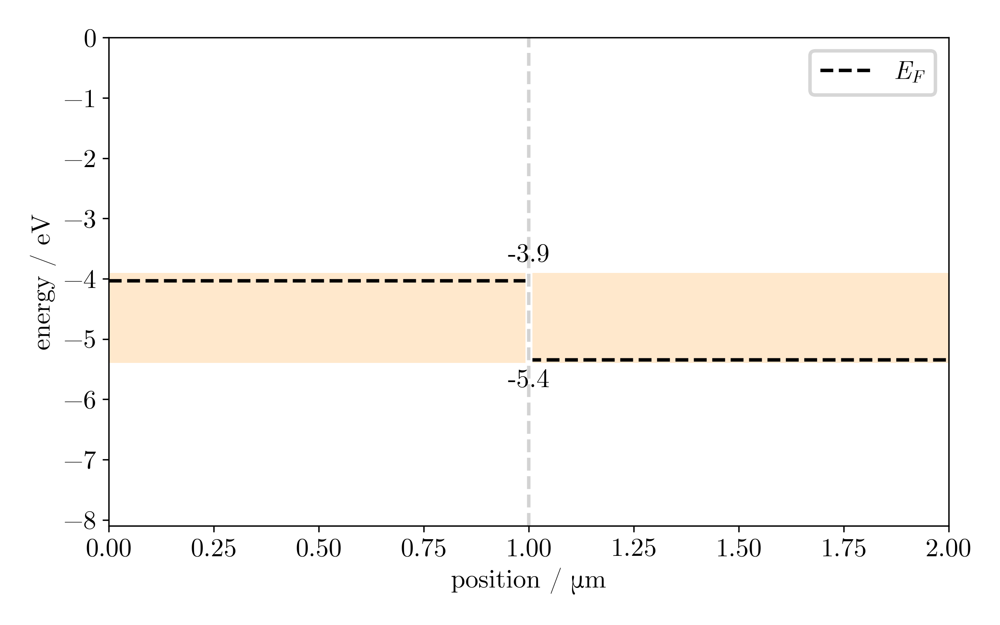
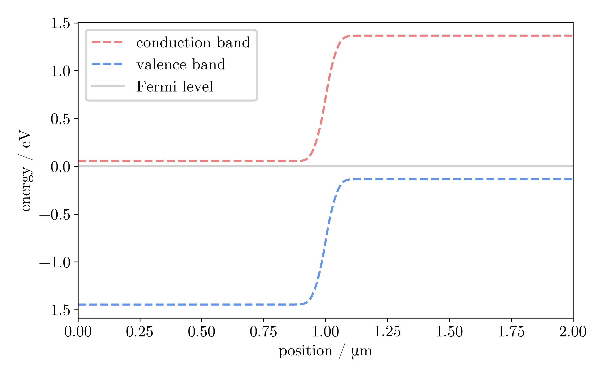
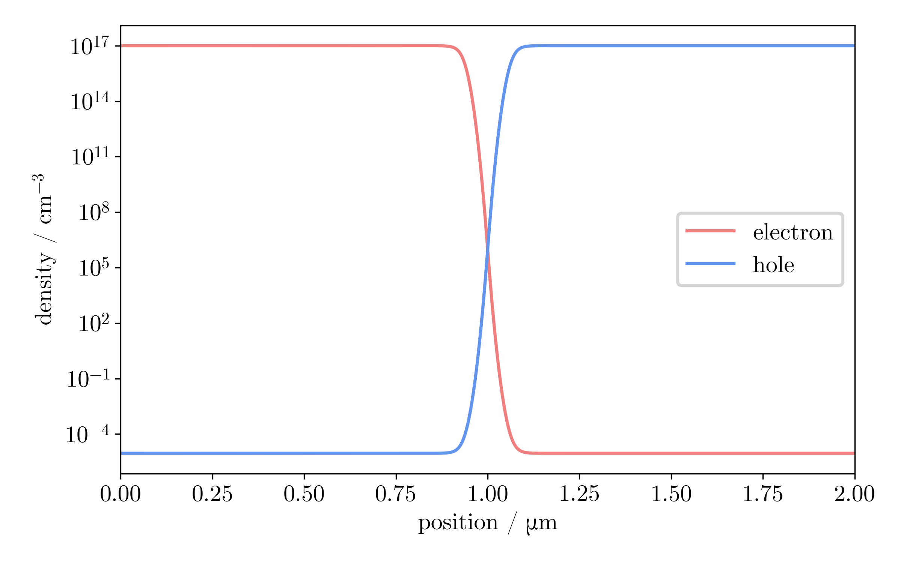

# ∂PV
A photovoltaic simulator with automatic differentation, built on `JAX`. To install via `pip`, simply use the command

```
pip install deltapv
```

`deltapv` features a simple interface for most common cell structures. For a simple p-n homojunction, the following code computes the IV curve:

```
import deltapv as dpv

material = dpv.create_material(Chi=3.9,
                               Eg=1.5,
                               eps=9.4,
                               Nc=8e17,
                               Nv=1.8e19,
                               mn=100,
                               mp=100,
                               tn=1e-8,
                               tp=1e-8,
                               A=2e4)
des = dpv.make_design(n_points=500,
                      Ls=[1e-4, 1e-4],
                      mats=material,
                      Ns=[1e17, -1e17],
                      Snl=1e7,
                      Snr=0,
                      Spl=0,
                      Spr=1e7)
results = dpv.simulate(des)
```

Several convenient plotting functions are provided to visualize important quantities.

```
dpv.plot_iv_curve(*results["iv"])
dpv.plot_bars(des)
dpv.plot_band_diagram(des, results["eq"], eq=True)
dpv.plot_charge(des, results["eq"])
```





